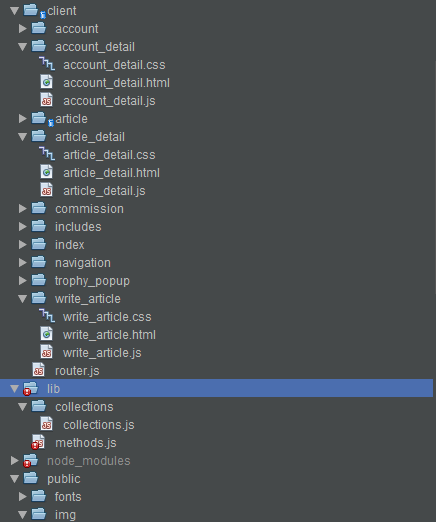
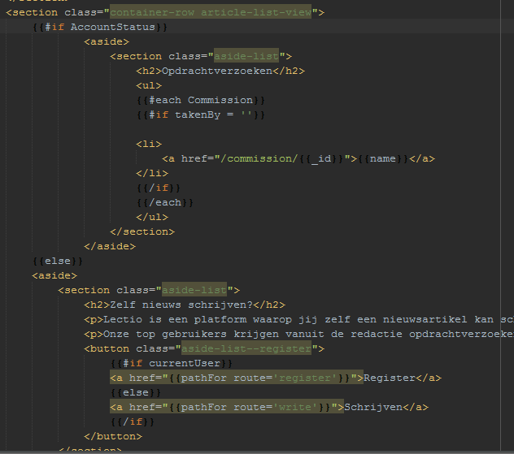
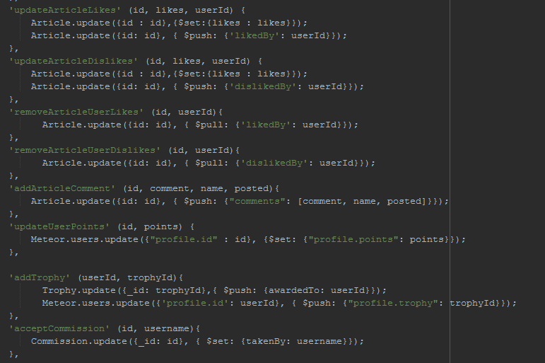

http://joshonwezen.com/

##Contents

* Probleemdefinitie
* User story dat mijn prototype uitlegd
* Feature List
* Code Examples & Structuur
* Welke vakken komen terug in mijn app
* Planning
* Herkansing issues resolved

##Probleemdefinitie

Frank van de Persgroep kwam naar ons toe met het idee om een nieuwsplatform te beginnen voor jongeren. Jongeren komen de laatste jaren veel minder in aanraking met kranten
wat voor de Persgroep een slecht teken is aangezien zij grote kranten onder hun namen hebben zoals de Volkskrant. Nu is het probleem niet dat jongeren minder geïnteresseerd zijn in nieuws. 
Het probleem is dat jongeren tegenwoordig hun nieuws vinden op sites als vice.com of decorrespondent.nl, veel nieuwssites gebruiken tegenwoordig ook een structuur om abonnementen te houden via het internet. 
Wij wilde voor ons nieuwsplatform echter niet aan abbonnementen denken. Voor dit prototype had Frank het idee om jongeren zelf nieuws te laten schrijven, user generated content is namelijk de toekomst (facebook, uber, airbnb).

Nu wilde de Persgroep wel geld betalen aan jongeren zodat er wel kwaliteit content op komt, zo heb ik een account structuur bedacht waar een gebruiker Professional kan worden en nieuws kan schrijven.
Dit geeft vaste gebruikers meer reden om te blijven schrijven voor de site, en vooral ook kwaliteit. Nieuwe gebruikers zullen hier niet zo snel in aanraking mee komen maar wel door een welkomsbericht op de hoogte
gebracht worden van het bestaan van de Professional status. Wanneer de Professional status bereikt is zullen gebruikers opdrachtverzoeken krijgen zodat zij betaald kunnen krijgen, de beloning hiervoor staat bij het verzoek.

De app moet een prototype zijn van het platform waar zelf content op geplaatst kan worden en gelezen, sorting is op basis van likes en spreekt voor zich, ook d.m.v. datum en author erbij te zetten. Verder moet het een idee krijgen van de site en dummy content zoals search balk / social media icons bevatten om iets van een
sfeer te geven van wat er later mee gedaan kan worden. Niet alles hoeft functioneel te zijn dus, alleen de user story. 

##User Story

* Naam: Rebekka
* Leeftijd: 18
* Studie: Journalistiek
* Interesses: Film, muziek, festivals en politiek

Rebekka zit in het eerste jaar van haar studie journalistiek. Ze vind het erg leuk om artikelen te schrijven voor school maar wil dit graag ook buiten
school om doen. Zelf heeft ze een blog en deelt dit soms met haar vrienden op facebook. Ze wilt echter meer mensen bereiken met haar artikelen en het
liefst hier ook geld voor verdienen maar status is ook van groot belang voor haar aangezien ze naamsbekendheid wilt zodat ze naar haar studie freelance
werk kan vinden.

Op de site kan Rebekka andere nieuwsartikelen lezen van mensen die net zo'n passie voor schrijven hebben als zij en zit ze in een community met mensen
met dezelfde interesses. Zelf wilt ze echter ook schrijven en daarom heeft ze een account aangemaakt op onze website. Met haar account kan ze commenten op andere artikelen en zelf ook artikelen schrijven. 
Haar doel is uiteindelijk om hier geld aan te verdienen en door genoeg erkenning binnen de community (likes op haar artikelen) of door een actieve gebruiker te zijn kan zij de "Professional" status bereiken. Wanneer haar account "Professional" is krijgt zij
een extra tab te zien op de site met opdrachtverzoeken die zij kan accepteren.

Feature List:

* Homepage met artikelen
* Login/Register
* Likes/Dislikes op artikelen
* Sorteren lijst op likes
* Artikel schrijven
* Accountstatus - Standard/Professional
* Opdrachtverzoeken

Extra Features:

* Comments
* Zoekoptie / filters (dummy)
* Categories (dummy)
* Social media buttons (dummy)
* Trophy's

##Code examples

De persgroep app die ik gebouwd heb is gebouwd in Meteor. Hieronder is zichtbaar hoe ik de filestructuur heb opgezet.

De frontend van de app is gedaan met blaze, templates en spacebars. Hieronder is een voorbeeld te zien waarin 3 verschillende HTML codes ingeladen worden op basis van de account status van de gebruiker.

Voor de backend structuur heb ik voor elke actie een method aangemaakt zodat het overzichtelijk blijft wat er wordt aangepast.
Hieronder is een voorbeeld te zien van het user likes systeem. Zo heb ik voor elk artikel een array met de personen die het geliked/disliked hebben en haal ik vervolgens deze personen er weer uit wanneer zij hun mening over het artikel aanpassen.

Experience structuur uitgelegd:

* Comment - 5 punten
* Like/Dislike - 5 punten
* Artikel schrijven - 50 punten
* Professional status behalen = 200 punten + 1 article

Dit wordt allemaal achter de schermen gehouden aangezien het niet belangrijk is om precies te weten hoeveel punten je hebt en hoeveel je verdient. Voor een gebruiker is het alleen belangrijk om te weten
dat je een actieve gebruiker moet zijn om Professional status te bereiken.

##Real-Time Web
Wat komt erin terug?

* Experience structuur, je krijgt opdrachtverzoeken en trophy's wanneer je genoeg punten behaald hebt. 
* Likes/Dislikes (sorting)
* Likes/Dislikes denk aan reddit.com waar upvotes/downvotes minder tellen na een bepaald aantal en je periodiek downvotes krijgt zodat het artikel uit de top verdwijnt wanneer er genoeg tijd voorbij gaat.

##Web-App From Scratch

Routing is gedaan op basis van een single-page app. Cerder is er geen API nodig maar is er een heel CMS systeem gebouwd rond MongoDB.

##CSS to the Rescue

Responsive app (navigation, list view, detail view), animaties met scaling wanneer hovered. 
Verder een text editor.

##Browser Technologies

Aangezien mijn app in meteor is gebouwd is het niet voor hele oude browsers beschikbaar en ook niet zonder JS. Zo heeft opera mini hier moeite mee.
Verder is mijn app goed opgebouwd zodat alle CSS en HTML werkend is in oude browsers die bijv. geen flex ondersteunen.

Alle JS implementaties werken zonder verdere moeite. Texteditor heeft geen fallback aangezien het een enhancement is op de textarea.

##Performance Matters
Hieronder mijn performance bevindingen. Alles laad snel en wordt geoptimized. Zo zie je maar 15 requests (veel van meteor zelf) en zelfs minder dan 1mb loading.

Hieronder mijn performance bevindingen uit kadira. Naar de mb's moet je niet echt kijken aangezien mijn sessie als host uiteraard het gemiddelde mb's ver omhoog trekt.
Het was echter wel erg interessant om te zien welke collections en pagina's de meeste cpu power en mb's vreten.

##Planning

Mijn planning zoals hij was en geupdate is elke week. Verder werktte ik met features uit mijn procesboek.

###Week 1

In week 1 heb ik mij vooral gefocused op het maken van wireframes en het idee van Frank uitwerken. 
Ik heb een meteor app opgezet en hier wat basic dingen in gestopt om alvast aan Frank te laten zien.

###Week 2

De standaard functies zoals registreren en inloggen heb ik hier toegevoegd. Verder heb ik de collection structuur uitgewerkt en in mijn procesboek opgeschreven:

Vb. hiervan:

Article -
* title
* content
* author
* sent
* userId
* likes
* image
* video
* likedBy[]
* dislikedBy[]
* comments[]
* id
* addedAt

Verder heb ik de routing opgezet en heb ik gekeken naar de mogelijkheden voor bijvoorbeeld file upload op de server en een texteditor.

###Week 3

In week 3 heb ik mij gefocused op de artikel schrijven pagina en het uitwerken hiervan. Meerdere texteditors geprobeerd en de styling toegepast
zodat ik aan Frank al een basic prototype had om te laten zien wat er goed uit zag. Verder heb ik de logica achter het experience systeem toegevoegd.
Bij het experience systeem gebeurd alles achter de schermen en het moet ook niet duidelijk zijn voor de gebruiker hoe er precies punten worden verdient
aangezien dit niet per se belangrijk is voor hun.

Hoe de punten werken:

* Comment - 5 punten
* Like/Dislike - 5 punten
* Artikel schrijven - 50 punten
* Professional status behalen = 200 punten

Verder heb ik op basis van likes de sorting gedaan zodat er een realtime element in komt (buiten het verkrijgen van punten).

###Week 4

In week 4 heb ik extra's als een comment systeem toegevoegd en het likes/dislikes systeem afgebouwd en gefinetuned. Verder heb ik de opdrachtverzoeken erin
geplaatst zodat deze gebruikt kunnen worden. Ik heb in deze week mij vooral op CSS gefocused.

###Week 5

In de laatste week heb ik nog even goed naar bijv. Kadira gekeken om de performance te meten, bekeken waar dit beter kon en dit aangepast. Verder heb ik nog de 
laatste hand aan mijn CSS gelegd en heb ik een trophy systeem (op verzoek van Frank) toegevoegd. Het trophy systeem heb ik uiteindelijk achter de schermen gehouden op
aanrader van de leraren aangezien zij dit toch niet zo'n goed idee vonden.

##Herkansing issues

De commit namen en issue namen komen vrijwel overeen, er is duidelijk uit op te maken welke bij welke hoort dus dit zal ik niet verder uitleggen.

Issue 1: Naam veranderen van de app - De Persgroep was geen goeie naam aangezien het van de opdrachtgever is hoorde ik tijdens de feedback, dus dit heb ik verandert in "Lectio" wat lezen in het latijn betekend.

Issue 2: Groter lettertype, meer relative units en in het geheel de site vergroten (oogt klein op desktop) - Gefixt door lettertype te wijzigen en de width van de content tabjes te verhogen.

Issue 3: Opdrachtverzoeken lijst niet zichtbaar klikbaar - Kreeg hier als feedback op dat een simpele oplossing was om hier bijvoorbeeld bullet points voor te zetten zodat het duidelijk maakte dat het losse selecteerbare items waren.

Issue 4: Uitleg voor niet ingelogde gebruikers om de flow te verbeteren van het prototype - Uitleg tekst neergezet wanneer niet is ingelogd of wanneer niet Professional status bereikt is. Wanneer wel de Professional status bereikt is zullen gebruikers
geen tekstje zien aangezien het doel van de site dan al duidelijk is en er gewoon via opdrachtverzoeken naar het schrijven genavigeert kan worden.

Issue 5: Teveel divs - Aangepast zodat nu alle divs die articles of sections hoorde te zijn dit ook echt zijn.

Issue 6: Probleemdefinitie in readme en opbouw - Gefixt door probleemdefinitie uit te schrijven onderbouwd door een user story die mijn prototype uitlegd. Verder inhoudsopgave gemaakt die elk hoofdstuk in de readme uitlegd.

Issue 7: CSS verbeterd - Globaal alles aangepast zodat er kortere minder complexe selectors zijn.
