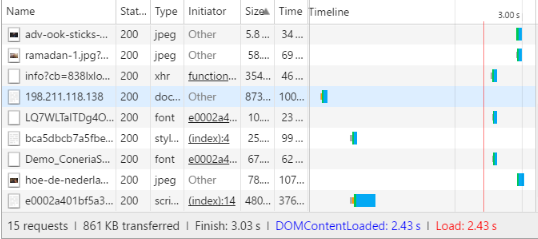
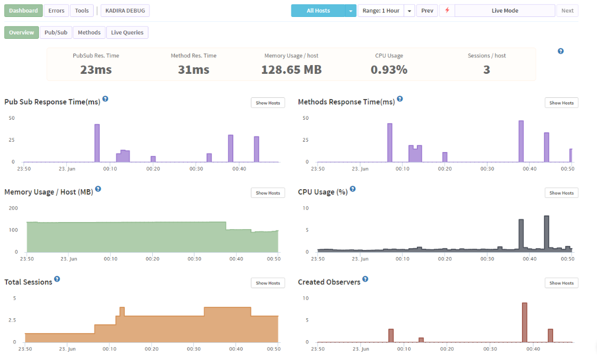
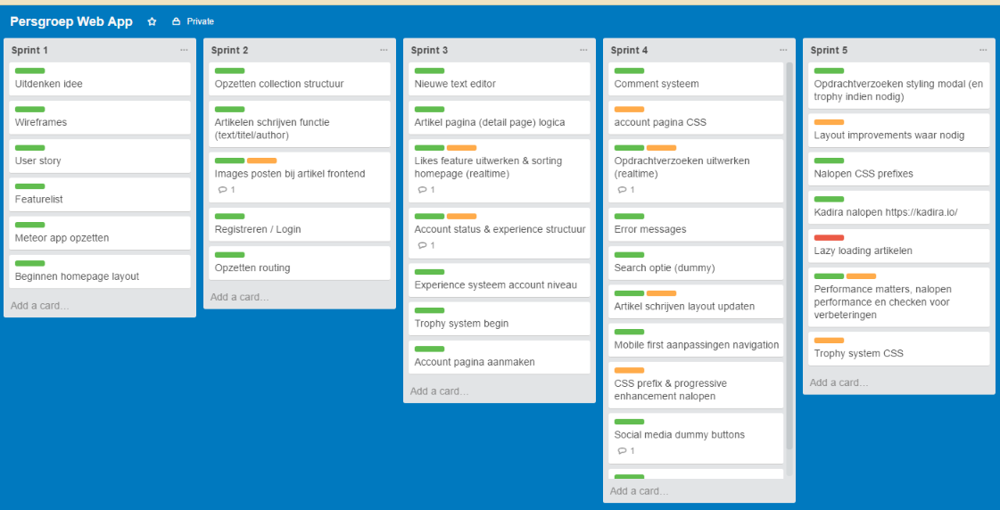

http://joshonwezen.com/

##User Story

* Naam: Rebekka
* Leeftijd: 18
* Studie: Journalistiek
* Interesses: Film, muziek, festivals en politiek

Rebekka zit in het eerste jaar van haar studie journalistiek. Ze vind het erg leuk om artikelen te schrijven voor school maar wil dit graag ook buiten
school om doen. Zelf heeft ze een blog en deelt dit soms met haar vrienden op facebook. Ze wilt echter meer mensen bereiken met haar artikelen en het
liefst hier ook geld voor verdienen maar status is ook van groot belang voor haar aangezien ze naamsbekendheid wilt zodat ze naar haar studie freelance
werk kan vinden.

Op de site kan Rebekka andere nieuwsartikelen lezen van mensen die net zo'n passie voor schrijven hebben als zij en zit ze in een community met mensen
met dezelfde interesses. Zelf wilt ze echter ook schrijven en daarom heeft ze een account aangemaakt op onze website, hiervoor moet ze eerst toegelaten worden
als schrijver door middel van een proefartikel op te sturen. Nadat ze is toegelaten kan ze commenten op andere artikelen en zelf ook artikelen schrijven. 
Haar doel is uiteindelijk om hier geld aan te verdienen en door genoeg erkenning binnen de community (likes op haar artikelen) kan zij de "Professional" status bereiken. Wanneer haar account "Professional" is krijgt zij
een extra tab te zien op de site met opdrachtverzoeken die zij kan accepteren.

Feature List:

* Homepage met artikelen
* Login/Register
* Likes/Dislikes op artikelen
* Sorteren lijst op likes
* Artikel schrijven
* Accountstatus - Standard/Professional
* Opdrachtverzoeken

Extra Features:

* Comments
* Zoekoptie / filters (dummy)
* Categories (dummy)
* Social media buttons (dummy)
* Trophy's

##Real-Time Web
Wat komt erin terug?

* Experience structuur, je krijgt opdrachtverzoeken en trophy's wanneer je genoeg punten behaald hebt. 
* Likes/Dislikes (sorting)
* Likes/Dislikes denk aan reddit.com waar upvotes/downvotes minder tellen na een bepaald aantal en je periodiek downvotes krijgt zodat het artikel uit de top verdwijnt wanneer er genoeg tijd voorbij gaat.

##Web-App From Scratch

Routing is gedaan op basis van een single-page app. Cerder is er geen API nodig maar is er een heel CMS systeem gebouwd rond MongoDB.

##CSS to the Rescue

Responsive app (navigation, list view, detail view), animaties met scaling wanneer hovered. 
Verder een text editor.

##Browser Technologies

Aangezien mijn app in meteor is gebouwd is het niet voor hele oude browsers beschikbaar en ook niet zonder JS. Zo heeft opera mini hier moeite mee.
Verder is mijn app goed opgebouwd zodat alle CSS en HTML werkend is in oude browsers die bijv. geen flex ondersteunen.

Alle JS implementaties werken zonder verdere moeite. Texteditor heeft geen fallback aangezien het een enhancement is op de textarea.

##Performance Matters
Hieronder mijn performance bevindingen. Alles laad snel en wordt geoptimized. Zo zie je maar 15 requests (veel van meteor zelf) en zelfs minder dan 1mb loading.

Hieronder mijn performance bevindingen uit kadira. Naar de mb's moet je niet echt kijken aangezien mijn sessie als host uiteraard het gemiddelde mb's ver omhoog trekt.
Het was echter wel erg interessant om te zien welke collections en pagina's de meeste cpu power en mb's vreten.

##Planning

Mijn planning zoals hij was en geupdate is elke week. Verder werktte ik met features uit mijn procesboek.

